**버닝비버**는 스마일게이트에서 주최하는 인디게임 페스티벌이며, **비버잼**은 버닝비버의 행사 중 하나인 게임 잼이다. 작년에 이어서, 올해는 '경기게임잼과 함께하는 비버잼 2023'이라는 이름으로 돌아왔다. [작년과 마찬가지로](/blog/eof-2022-3#버닝비버-게임잼-비버잼), 올해도 참가하게 되었다.

행사 당일인 8월 18일이 되었다. 행사는 오후 8시에 시작하며, 이보다 30분 전인 7시 30분부터 입장이 가능하다. 시간에 맞춰 행사장에 도착하기 위해, 오후 4시에 일찍 퇴근을 찍고 집으로 황급히 돌아온 후 짐부터 챙겼다. 먼저 노트북에 설치된 Unity와 JetBrains Rider를 최신 버전으로 업데이트하는 동시에, 여분의 옷, 세면 도구, 그리고 혹시나 해서 멀티탭도 챙겼다. 작년에 참가했을 땐 짐을 최대한 줄여서 백팩 하나만 사용했지만, 이번엔 캐리어를 준비해서 준비물을 넉넉하게 챙겨갈 수 있었다.

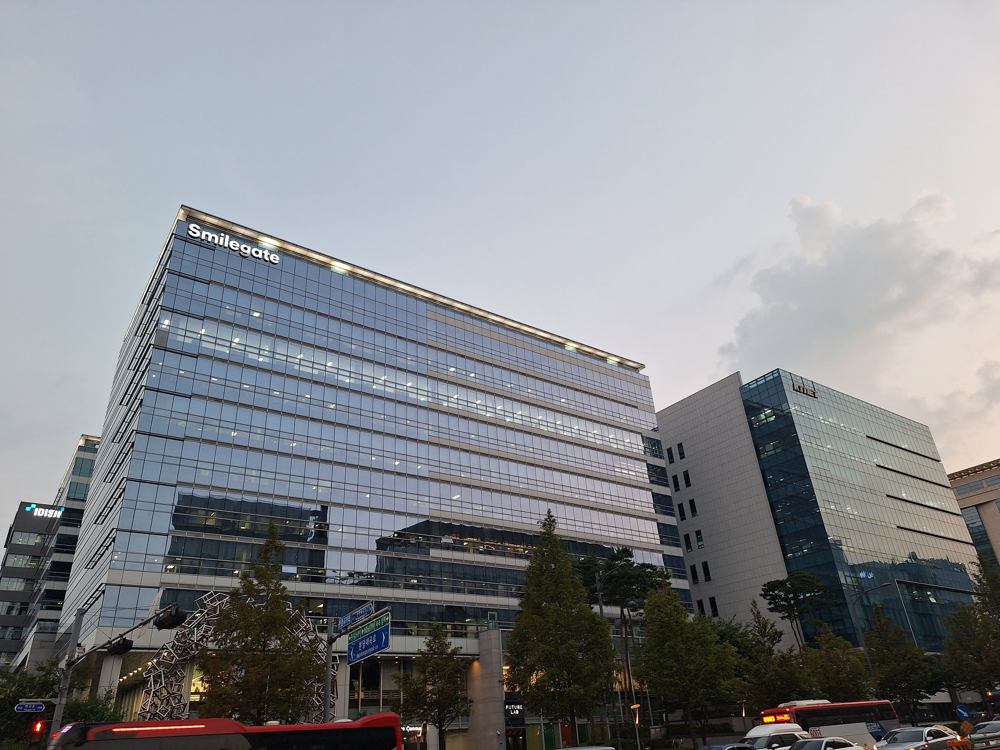

작년엔 서울 한 곳에 장소를 대여해서 진행한 것과 달리, 올해는 스마일게이트 캠퍼스 사옥 내에서 개최되었다. 이번을 계기로 처음으로 판교에 방문하게 되었다. 열차를 타고, 이어서 버스를 타서, 스마일게이트 캠퍼스 사옥에 도착했다.

## Day 1

처음 스마일게이트 캠퍼스 건물로 들어설 때, 첫 인상은... '로비가 굉장히 넓다'. 계단을 타고 행사가 열리는 지하로 내려가보니, 비버잼을 알리는 홍보 배너와 함께 스태프분들이 환영을 해주고 있었다.

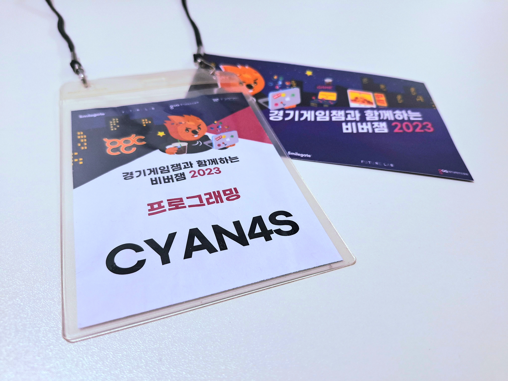

나의 닉네임이 적힌 네임택 목걸이, 그리고 각종 기념품들이 담긴 에코백을 받고, 안내를 받아 행사장으로 들어갔다. 행사 시작 시간에 딱 맞춰 들어갔는데, 이미 많은 사람들이 모여 있었다. 나중에 알고 보니 다른 참가자들은 마치 오픈런하듯이 일찌감치 와있었다고.

다들 버닝비버가 그려진 후드집업 입고 있었고, 옷에 자기소개 문구가 적힌 스티커들이 붙여 있었다. 나도 기념품 가방에 들어있던 후드집업을 꺼내 입은 후, 구석에 마련된 스티커를 붙이는 공간으로 갔다. 스티커에 무엇을 적을 지 고민하다, 그냥 적고 싶은 건 다 적기로 했다.

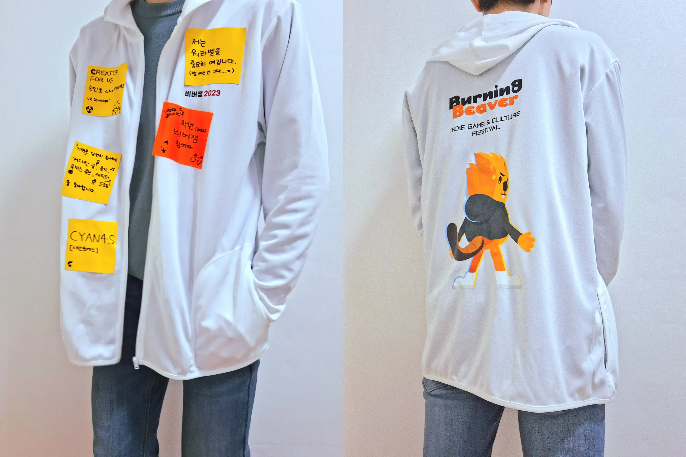

(지금 보니까 스티커는 좀 과했다는 생각도 든다.)

행사장 바닥에 깔린 각 참가자들의 닉네임이 적힌 수많은 방석들 중, 내 닉네임이 적혀있는 방석을 이리저리 돌아다니며 찾아다녔고, 마침내 방석을 찾아 제 위치에 앉을 수 있었다. 다른 참가자들이 마저 오는 것을 보며, 행사가 시작되길 기다렸다.

여담으로 지하 공간이 전체적으로 분위기가 도전적이면서 과감한 인테리어 디자인이 눈에 띄었는데, 알고 보니 이 곳에서 게임과 관련한 소소한 행사가 많이 열린다고 한다.

### 오리엔테이션

작년에도 MC를 맞으셨던 포포님의 오리엔테이션으로 행사가 시작되었다.

처음엔 버닝비버에 대한 잠깐의 소개가 있었다. 이번 게임 잼을 포함한 버닝비버 행사는 **축제**임을 계속해서 강조하셨다. 작년 비버잼 때에도 느낀 것이지만, 경쟁을 최대한 배제하여 순수히 창작의 즐거움을 지향하는 모습이 확실히 느껴졌다.

올해는 경기게임잼과 협업을 하는 것으로 보였는데, 관계자분이 인디게임을 개발함에 있어 받을 수 있는 지원에 대해 알려주셨다. 개발부터 출시, 그리고 사후 지원까지, 받을 수 있는 혜택이 굉장했는데, 추후에 개인적으로 게임을 본격적으로 만들게 된다면 어떤 지원을 받을 수 있는지 알아보는 것이 좋을 것 같다.

스마일게이트의 게임 플랫폼인 스토브가 많이 언급되었는데, 스토브에는 인디게임에 특화된 [**스토브 인디**](https://store.onstove.com/)라는 서비스가 있다. 한국에 인디게임을 쉽게 출시할 수 있는 플랫폼이 있다는 것은 분명한 이점일 것이다. 여태까지 나는 게임을 데모 수준까지 만들고 GitHub에만 공개를 해왔다. 하지만 언젠가는 나만의 게임을 제대로 만들어, 스토브같은 정식적인 게임 플랫폼에 배포할 것이다. (물론 여유가 된다면…)

설명이 끝나고, 아이스 브레이킹 시간으로 임의로 맺어진 팀원들과 간단한 게임이 진행되었다. 6 X 6 보드의 각 칸에 질문이 적혀있고, 주사위를 굴려 나온 질문에 대답을 하는 게임이었다. 당연하겠지만, 질문엔 게임과 관련된 질문이 많았다.

모든 칸에 질문이 적혀있는 것은 아니었는데, 일부 칸은 내용이 비어있어 원하는 질문을 적어 넣을 수도 있고, 질문이 아닌 다른 팀으로 이동하는 미션이 걸릴 때도 있었다. 미션이 걸릴때마다 다른 팀으로 옮겨가며 더 많은 참가자들과 소통할 수 있었다. 팀마다 분위기가 조금씩 다른 것도 재밌는 부분.

아이스 브레이킹 시간이 끝나고, 모두가 기다리던 이번 게임 잼의 주제가 드디어 발표되었다. 이번 비버잼 2023의 주제는 바로 '**환경**'. 최근 환경 문제가 지속적으로 대두되기에, 이에 대해 경각심을 얻을 수 있는 의미있는 주제였다. 다만, 참가자들이 '환경'이란 단어를 어떤 의미로 해석할지는 완전히 자유.

### 팀 빌딩

팀 빌딩은 기획을 원하는 분들이 게임 기획안을 담은 포스터를 벽에 붙이고, 다른 참가자들은 관심이 가는 기획자에게 찾아가 팀을 완성하는 방식이였다. 이는 작년과 큰 차이는 없다. 다만 이번에 달라진 점이라면, 무조건 기획자 3명과는 대화를 해야 하고, 초반 1시간 동안에는 팀 빌딩이 불가능하다는 점.

나는 작년과 마찬가지로 직접 기획을 하는 것보단, 기획자를 찾아가는 방식을 선택했다. 벽에 붙은 기획안들을 하나씩 둘러보다, **리듬게임 기획안**이 보이길래 바로 찾아갔다.

사실 이번엔 리듬게임이 아닌 다른 장르의 게임을 도전해보고 싶은 마음도 조금은 있었다. 실제로 다른 팀들과도 대화를 나눴다. 하지만 애초에 게임잼에 참여한 이유가 철저히 재미를 위한 것이었으므로, 도전적으로 나서기보단 가장 재밌게 만들 수 있는 것을 선택하였다.

팀 빌딩 시간이 지나고, 최종적으로 기획자, 프로그래머(_나다._), 일러스트레이터, 이렇게 3인 팀이 만들어졌다. 팀원들과 어떤 리듬게임을 만들지, 그리고 환경이란 주제와는 어떻게 연관을 지을지 간단히 회의를 했고, **첫날부터 뭔가를 하려 하지 말고 일단 첫날 밤엔 무조건 자기로 결정했다.**

그리고 팀 이름을 정해야 했는데, 마침 팀원이 내 후드에 붙어있는 자기소개 스티커에 적혀있던 '워라밸' 문구가 눈에 띄었는지 워라밸을 이름으로 제안했고, **그대로 팀 이름이 '워라밸'이 되었다.**

팀 등록을 한 이후, 팀 빌딩이 완료된 다른 참가자들과 같이 1층 로비로 이동했다. 처음에 사옥에 들어오면서 본 거대한 1층 로비에 책상을 비롯한 개발 환경이 마련되었다. 다만 공간 자체는 넓은데, 작년보다 책상이 작아진 것 같았다.

적당한 곳에 자리를 잡아 작업 환경을 빠르게 구성하고, 팀원들과 간단히 수다를 떨며 서로에 대해 알아가고, 야식을 먹은 뒤 바로 수면에 들어갔다. 진짜로 첫날은 개발을 안 했다.

여담으로 올해도 간식이 풍부하게 준비되어 있었다. 다양한 종류의 과자, 캔커피, 우유, 그리고… **에너지 드링크**.

참고로 지하에 마련된 수면실에는 수많은 에어배드가 준비되어 있었는데, 작년과는 다른 종류의 에어배드였다. 작년에 사용한 간이 에어 배드는 여러 방면으로 안 좋은 평가를 받았다. 개인적으로는 마음에 들었는데, 문제는 몸을 뒤척일 때 소음이 상당하다는 것이다. 이것과 관련해 상당한 부정적인 피드백을 받았는지(...), 이번엔 제대로 된 에어 배드를 준비하셨다. 개인적으로 누웠을 때 느낌은 작년 것이 나았지만, 확실히 소음은 덜했다.

## 본격적인 개발 시작

### 컨셉 정하기

아침 10시쯤에 슬슬 일어나서 본격적으로 개발에 착수하였다. 가장 먼저 새 Unity 프로젝트를 생성해 GitHub에 공유하는 과정부터 거쳤다.

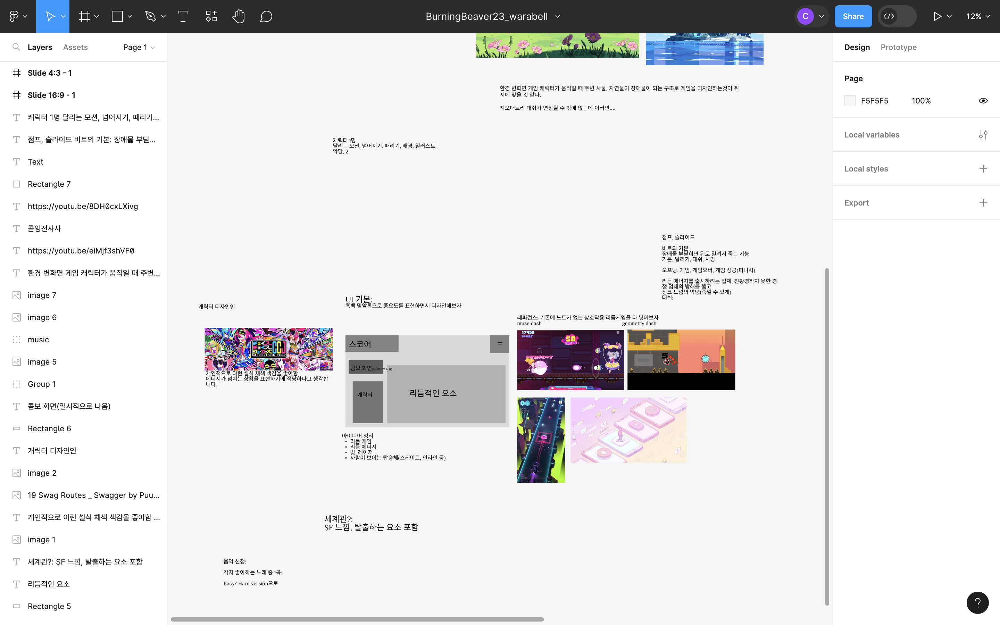

이후, 협업 디자인 툴인 Figma를 활용해 브레인 스토밍을 진행하였다. 아이디어 외에도, 게임의 프로토타입 디자인이나 진행 상황 등을 공유하는 일종의 칠판처럼 활용했다.

게임 개발의 전체 과정 중에서 **가장 힘든 부분이 컨셉 구상**이였다. 기획적으로 정해진 것이 없어도, 적어도 비주얼 컨셉을 정해야 그래픽 리소스 작업이 진행될텐데, 그 때 당시엔 아무 것도 정해진 것이 없었다.

사실 첫날 팀 빌딩 시간에 내가 간단히 제시한 아이디어가 '신개념 친환경 에너지인 리듬 에너지'였다. 그 땐 꽤나 좋은 평가를 받았는데, 막상 이를 중심으로 스토리를 구성하려 했으나 아무런 진전이 나질 않았다.

팀원들과 머리도 식힐 겸, 밖으로 나왔다. 건물 앞에 자그마한 공원을 잠시 돌아다니다, 카페에 들러서 팀원들에게 커피를 한 잔씩 사줬다. 행사장에 캔커피가 있긴 한데, 내 입맛엔 도저히 맞지 않아서…

돌아온 이후에도 아이디어 도출에 애를 먹던 중에, 일러스트레이터님이 동화 **빨간 망토**를 컨셉으로 해보는 것이 어떠한지 제안했다. 나를 포함한 팀원 모두가 이를 반겼고, 그대로 빨간 망토로 컨셉이 확정되었다.

이후 여러 리듬게임을 레퍼런스 삼아 게임의 큰 틀을 잡아두고, 당장 기획적으로 결정이 된 부분부터 하나씩 구현에 들어갔다.

그리고 게임에 사용할 음악을 찾아야 했다. 처음엔 상업용 리듬게임의 곡을 알아보았으나, 게임이 완성되면 외부로 배포되는 것이라, 저작권 문제로부터 비교적 자유로운 NCS(NoCopyrightSound)에서 곡을 골랐다.

여러 후보 곡들 중에서, 최종적으로 [TheFatRat의 Never be alone](https://youtu.be/Ic-gZlPFTkQ)을 사용하기로 했다.

### 초기 구현

맨 처음으로, 박자마다 막대기가 나와서 타이밍을 확인할 수 있는 일종의 가이드를 구현하였다. 매드 래트 데드의 하단부 파트를 따온 것이며, 이 때 사용되는 가이드 노트에 **오브젝트 풀**을 처음으로 사용해봤다. 그동안 게임 개발할 때 풀 기법을 사용해 본 적이 없었는데, 사실 풀이 필요한 만큼 규모가 비교적 큰 게임은 만든 적이 없었다.

전에 개인적으로 만든 리듬게임([RHYACTION LIVE](https://github.com/CYAN4S/rhyaction-live))도 노트 1000개가 한번에 움직여도 큰 문제가 없었다. 최적화가 필요하다면 도입했겠지만, 그동안의 게임 개발 경험을 통해 내 뇌에 박힌 "**제대로 작동하면 고치지 않는다**"의 마인드로 인해 도입을 미뤄두고 있다. 갑자기 비버잼에서 뜬금없이 사용한 이유도 단순히 "한번 써보고 싶어서"인거고.

다만, 지금 생각해보면 가이드는 딱히 필요가 없는 요소였다. 게임할 때 눈에 잘 띄지도 않고 도움도 안 된다. 그냥 오브젝트 풀을 처음으로 사용한 것에 의의를 두는 걸로.

그 외 구현은 수월했다. 리듬게임을 만들어 본 적이 있는 만큼 로직은 이미 머리 속에 있었고, 가끔 내용이 생각이 안 나면 예전에 작성한 코드를 참조했다. 기획자님도 리듬게임 개발 경험이 있으신 능력자여서, 개발이 더욱 원활히 진행될 수 있었다.

그래픽의 경우, 일러스트레이터님이 그래픽 리소스를 만들면, 기획자님과 내가 Unity의 Animation 도구를 이용해 게임 내 적절히 활용하는 것으로 전체적인 개발 흐름이 잡혔다. 리소스 공유는 Discord를 활용했다.

배경부터, 캐릭터가 걷는 애니메이션 키프레임 하나하나까지 그려주신 일러스트레이터님에게 다시 한 번 경의를 표한다.

### 채보 작성

기능 구현이 어느 정도 되었을 때, 채보를 슬슬 작업해야겠다는 생각이 들었다. 

일반적으로 리듬게임에서 채보란, 게임 내에서 어떤 노트를 어디에서 어느 타이밍에 나올지를 정의하는, 일종의 악보이다. 전체적인 게임플레이 경험을 결정짓는 요소이기에, 채보는 악곡만큼이나 중요하게 여겨진다.

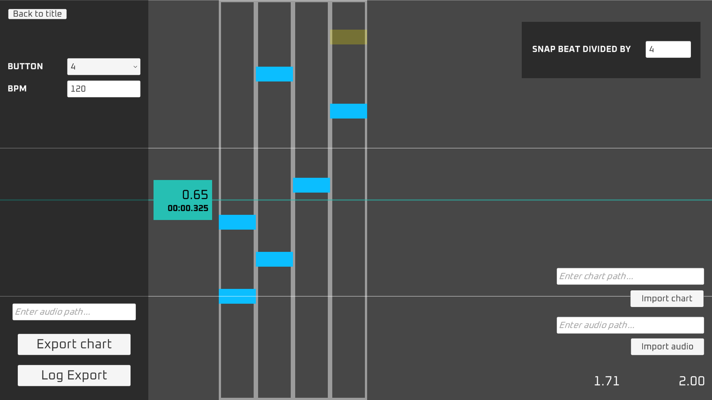

채보를 작성하기 위해, 이전에 만들어둔 RHYACTION LIVE의 채보 에디터를 간만에 꺼냈다. 이 에디터는 채보 데이터를 직렬화하여 JSON 파일을 생성해주는 고마운 도구다. 사실 에디터 개발에 시간을 많이 쏟진 않아 기능이 적고 안정성이 보장되지 않았지만, 지금 당장 잘 활용할 수 있는 유일한 에디터다.

RHYACTION LIVE를 위한 에디터라 최대 8개의 라인까지 지원하지만, 이 게임에선 2개의 라인만 사용한다. 첫번째 라인은 과일, 두번째 라인은 덤불에 대응된다.

게임 내에서 에디터에서 만든 JSON 문자열을 기반으로 채보 데이터를 생성하고, 게임 내에서 채보 데이터를 통해 과일과 덤불이 생성될 수 있게 만들었다. 이후 원활한 채보 수정을 위해, 게임 내에 문자열로 집어넣은 채보를 독립적인 외부 파일로 꺼낸 다음, 게임 내에서 이 파일을 정상적으로 읽을 수 있는지 확인하였다.

이후 채보를 작성하는데 뭔가 곡이 끝도 없이 있는 것이다. 일반적으로 리듬게임의 곡은 보통 3분을 잘 넘기지 않는데, 뒤늦게 확인해보니 **곡 길이가 4분을 넘기는 것이었다.** 급하게 MacBook에 있는 FL 스튜디오를 켜서 적당히 곡 컷팅을 해주고, 동시에 게임 내에서 음악이 박자에 정확히 맞춰서 재생될 수 있게 타이밍을 조절하였다.

## 마지막을 향해

사실 올해는 잠을 푹 자기로 마음을 먹었는데, 개발하다 보니 완성도에 욕심이 생기니 잠을 줄여서라도 개발을 이어나가게 된다… 게임 잼 때는 어쩔 수 없이 잠을 줄여야 되는 것 같다. 다만 이게 좋은 문화는 절대 아니고.

### 기획_진짜_최종

게임 플레이는 여러 리듬게임의 컨셉을 가져왔다. 매드 래트 데드와 뮤즈 대시를 합한 뒤, 뭐 이렇게 저렇게 하다보니(…), 태고의 달인이 되는 기적(?)이 일어났다.

F와 J 키를 이용해 과일 줍기, 그리고 덤불 베기 두 가지의 행동을 타이밍에 맞게 누르면 되는 간단한 게임이다.

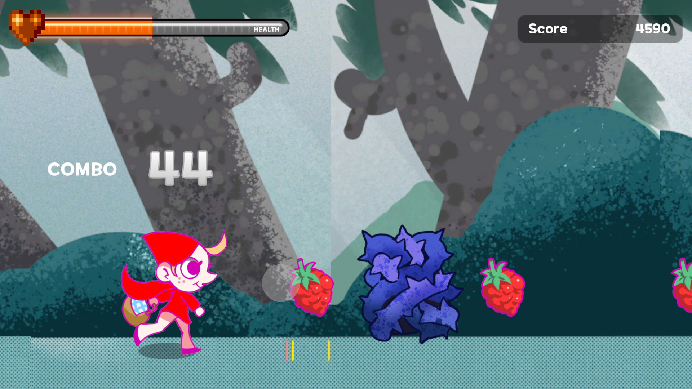

최종적인 기획 요소는 다음과 같다.

- 쿠키런과 비슷한 횡스크롤 형태이다. 주인공은 화면의 왼쪽에 위치하며, 기획상 주인공은 오른쪽 방향으로 계속 나아가기에 배경이 계속 왼쪽으로 이동한다.
- 키보드의 F와 J키로 조작한다. **F는 덤불 베기, J는 과일 줍기**다.
- 음악에 맞춰 **과일과 덤불**이 등장하며, 플레이어는 타이밍에 맞춰 과일 줍기 및 덤불 베기를 해야 한다.
    - 판정은 정확한 순서대로 PERFECT(±50ms, 100점), GOOD(±100ms, 50점), OK(±300ms, 10점)
- 덤불과 과일을 지나친다면 점수를 획득하지 못하며, 다음과 같은 판정이 뜬다.
    - 덤불을 지나친다면, OUCH 판정이 뜨며, 콤보가 끊기고, 체력이 깎인다.
    - 과일을 지나친다면, MISSED 판정이 뜨지만 불이익은 없다. 콤보는 끊기지 않고, 체력도 깎이지 않는다.
- 체력이 모두 깎이면 사망한다.
- 콤보가 20 이상이 되면 **피버 모드**가 발동되며, PERFECT, GOOD, OK 판정에 추가로 50점이 부여된다.
- 최부한부에 **대시(Dash) 타임**이 있으며, 이 때 동안 F와 J를 연타해야 한다.
    - 10박자(132 BPM 기준, 약 4.5초)동안이며, 한 번 누를 때마다 30점을 받는다.
- 클리어 조건은 죽지 않고 12000점 이상을 달성하는 것이다.
    - 12000점 이상은 굿 엔딩, 12000점 미만은 배드 엔딩이 나온다.

몇 번의 플레이 테스트를 해보면서 클리어 조건이나 점수를 적절히 조절했으며, 그와 동시에 판정을 좀 더 후하게 만들었다. 그런데 반복적인 플레이 테스트로 인해 게임 실력이 계속 늘어서인지, 후술할 시연 시간 때 체험을 해본 플레이어들로부터 어렵다는 평가를 많이 받았다.

### UI 디자인

어느 정도 기능 구현이 마무리가 되자, 퀄리티 향상을 위해 게임 내 부가적인 UI 요소를 만들었다. 평소에 했던 것처럼 Affinity Designer로 만든 뒤 Animation을 사용해 애니메이팅을 진행하였다.

게임 내 UI 요소로 처음엔 무료 글꼴인 쿠키런 글꼴을 사용했는데, 이 글꼴은 게임에는 사용할 수 없다는 조항을 뒤늦게 발견했다. 다행히 비슷한 느낌의 글꼴을 눈누에서 본 적이 있어서 바로 대체 글꼴을 탐색했고, 결론적으로 원스토어 팝 글꼴로 교체했다. 무료 글꼴을 사용할 땐 반드시 라이선스를 읽어보는 습관을 들여야겠다.

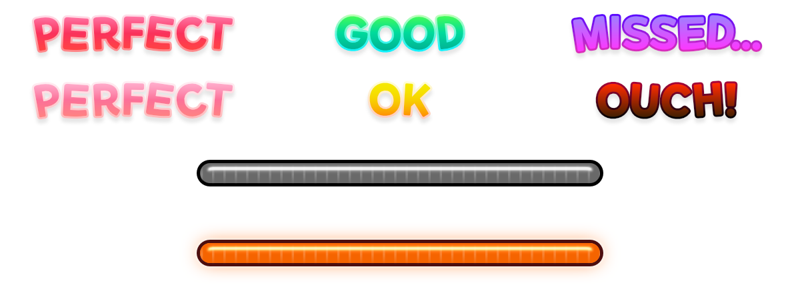

전체적으로 귀여운 느낌으로 제작하였다. 다만... 지금보면 일러스트 분위기와는 잘 어울리진 않는 것 같다.

### 엔딩 컷씬

엔딩은 '늑대를 물리치는 굿 엔딩'과 '늑대에게 처치당하는 배드 엔딩'으로 나눠지며, 위에서 언급했듯이 점수가 기준이 된다. 엔딩에 따라 엔딩 일러스트를 준비해주셨는데, 게임이 끝날 때 이를 바로 보여주기 보단 뭔가 간단히라도 애니메이팅을 해서 컷씬을 넣어보고 싶었다. 컷씬을 어떻게 구현할 까 생각하던 참에, Unity의 Timeline 기능이 생각나 시험삼아 적용해보았다.

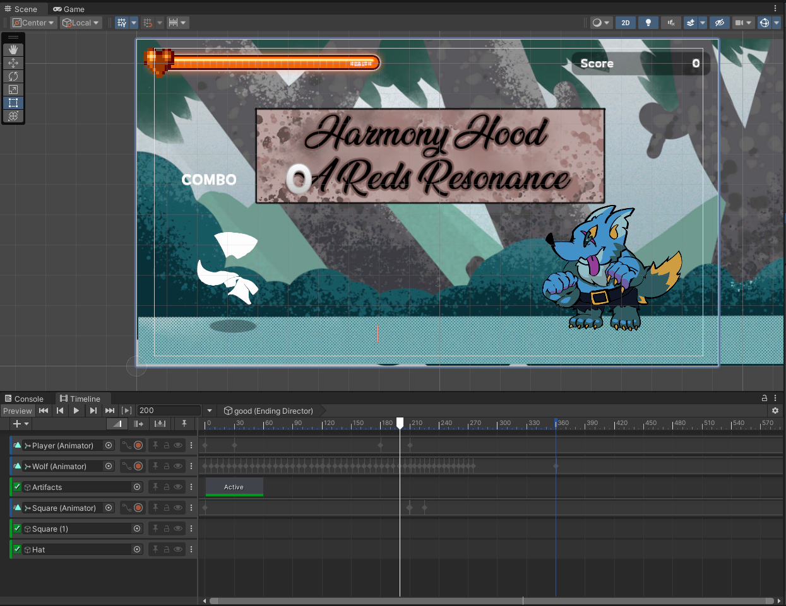

여태껏 Timeline을 사용해 본 적은 없지만, 즉석에서 배워서 바로 사용해도 문제가 없을 정도로 기존 Unity의 작업환경과 유사했다. 물론 시행착오가 있긴 했지만, 어떻게 컷씬 구현도 잘 넘어갔다.

### 아 맞다, 게임 이름!

게임 개발이 마무리될 때까지 게임 이름이 없다는 사실을 모두들 망각하고 있었는데, 한 팀원이 이를 리마인드해주셨다. 마침 기획자님이 GPT-3를 이용해 어울릴만한 여러 게임 이름을 생성했고, 그 중 'Harmony Hood: A Red's Resonance'라는 이름이 선정되었다.

## 개발 끝, 체험 시작.

비몽사몽한 상태로 어떻게 완성이 되었다. 근데 끝나고 생각해보니 환경이라는 주제와는 확실히 멀어진 듯 하다. 사실 주제와는 다른 게임을 만들어 놓고, **주제와 연결시키려고 어떻게든 우기는 것**이 게임잼의 묘미(...)라 생각이 든다.

게임 잼의 마지막을 장식할, 게임 시연 시간이 다가왔다. 모든 팀들이 게임 개발을 마무리하고 게임 빌드본을 제출한 뒤, 팀별로 플레이 환경을 준비하였다. 우리 팀은 노트북 2대로 시연을 준비했다.

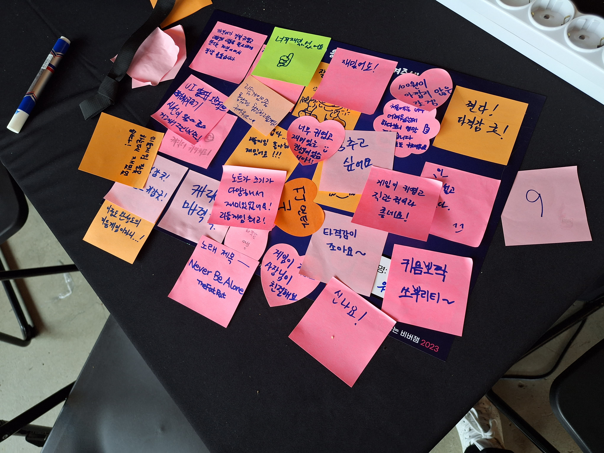

후기를 남길 수 있는 보드가 팀에 하나씩 주어졌는데, 여기에 다른 사람들이 포스트잇으로 후기를 써서 붙일 수 있다. 다른 팀의 게임을 체험해보러 다른 팀에 다녀온 사이, 포스트잇이 한가득 붙어있어서 매우 놀라웠고, 기쁘기도 했다.

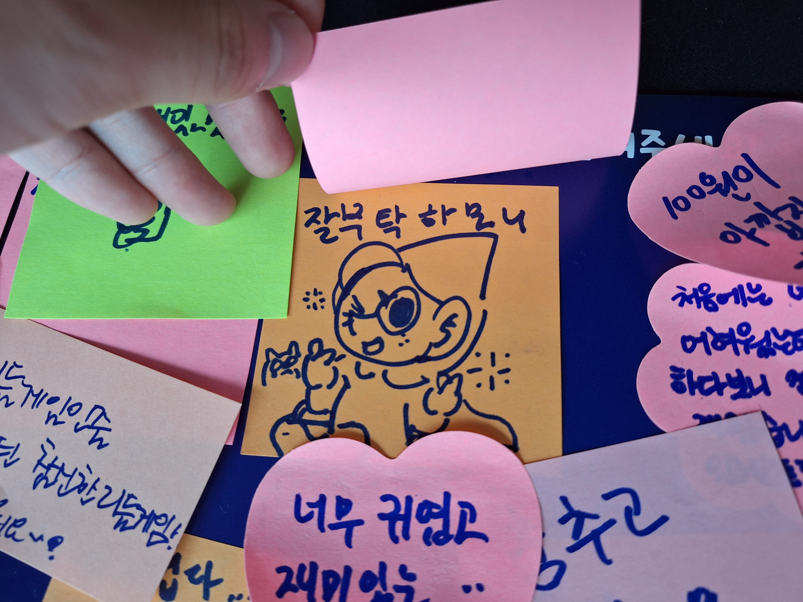

(일러스트레이터님이 남긴 그림. 귀엽다.)

만약 게임을 해보고 싶다면 [비버잼 공식 사이트](http://burningbeaver.com/64)에서 해볼 수 있다. Harmony Hood 이외에도, 다른 팀의 작품들도 즐길 수 있다.

이후 단체사진을 찍는 것으로, 2박 3일간의 비버잼이 막을 내렸다.

신분당선을 타고, 집에 도착하고, 간단히 씻은 다음, 바로 잤다. 당연하겠지만, 이번에도 눈이 저절로 감겼다.

## 글을 마치며…

올해는 작년보다 다소 이른 8월에 개최되었다. 작년엔 11월에 열려서 행사 장소에 오가는게 매우 추웠는데, 올해는 그 반대로 매우 더웠다. 작년엔 대학생으로 참여했는데, 올해는 직장인으로 참여했다는 점에서 감회가 새로웠다.

참가자들 중엔 게임 잼을 수십번 넘게 참여하신 분들이 계서서 놀랐다. 나도 게임 잼같은 행사를 적극적으로 많이 참여하고 싶지만, 앞으로 여유가 있을 지는 모르겠다.

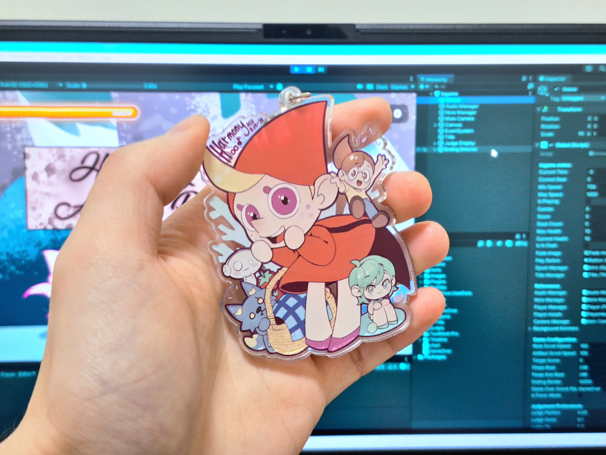

행사 이후 일러스트레이터님과 한번 만나게 되었는데, 감사하게도 일러스트레이터님이 직접 만드신 아크릴 키링을 선물해주셨다. 게임에 등장하는 빨간 망토와 늑대, 그리고 팀원들의 오너캐를 그려주셨다. 정말 감동스러웠다.

끝으로, **저와 함께 게임을 만들었던 팀 워라밸의 기획자님, 일러스트레이터님**, 다른 참가자분들, 그리고 인디게임의 진흥을 위해 이런 귀중한 기회를 마련해주신 스마일게이트에게 다시 한 번 진심을 담아 감사 인사를 드립니다.

### 그리고, 버닝비버 페스티벌

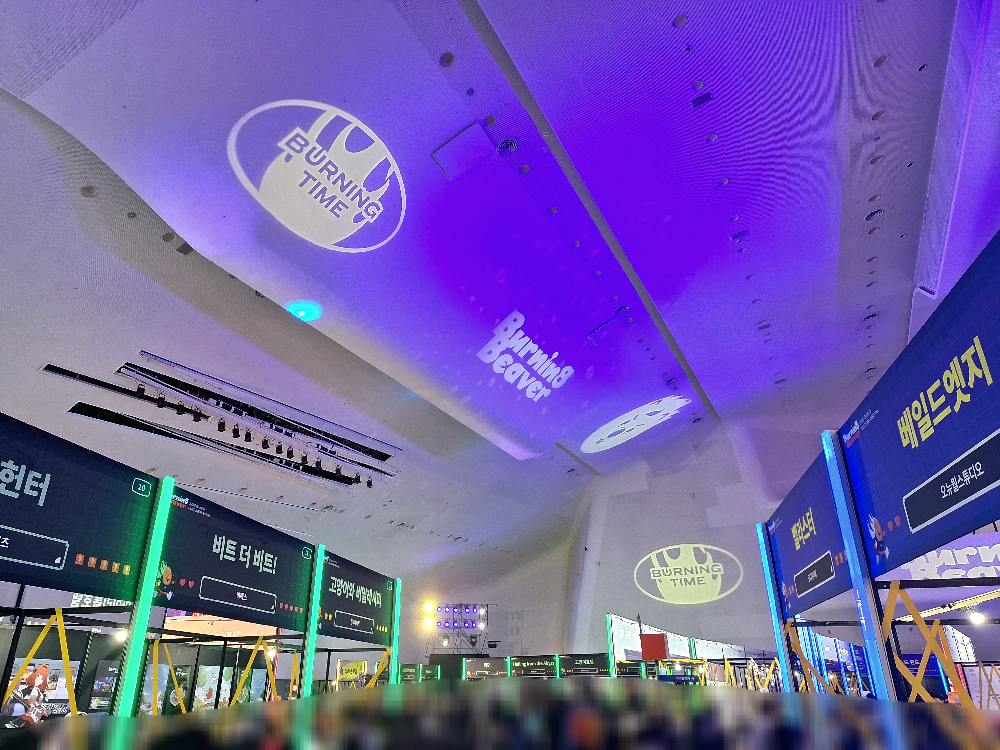

비버잼이 막 끝났을 때, 포포님이 버닝비버 페스티벌 초대권을 나눠주시길래 얼른 가서 받아왔다. 12월 1일부터 3일까지 DDP에서 열리는 버닝비버 페스티벌. 12월 3일 시간을 내서 다녀왔다. 이 때의 경험은 추후에 다룰 예정.

## 참고한 자료들

- [버닝비버 공식 유튜브 - 비버잼 현장 스케치 영상](https://youtu.be/AgQo5Ylrie8)
- [스마일게이트 공식 유튜브 - 비버잼 현장 스케치 영상](https://youtu.be/HhHA76s76-k)
- [스마일게이트 공식 유튜브 - 비버잼 소개 영상](https://youtu.be/xLsFnzjqfXM)