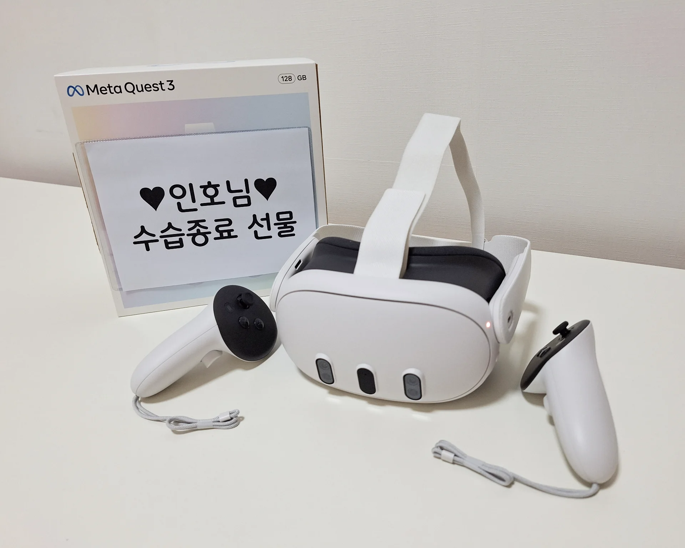
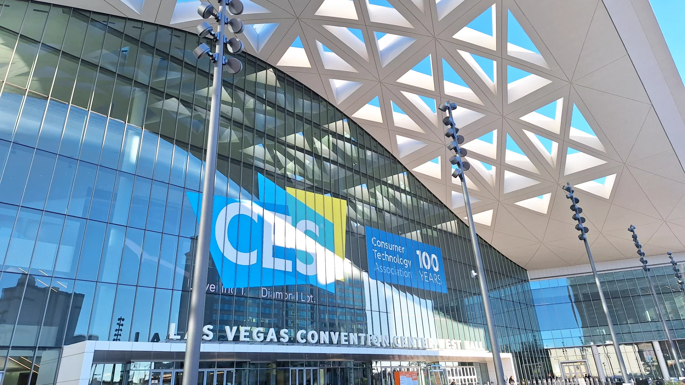
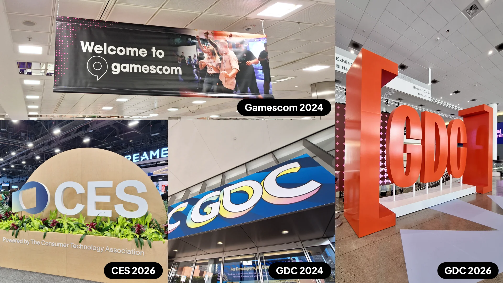
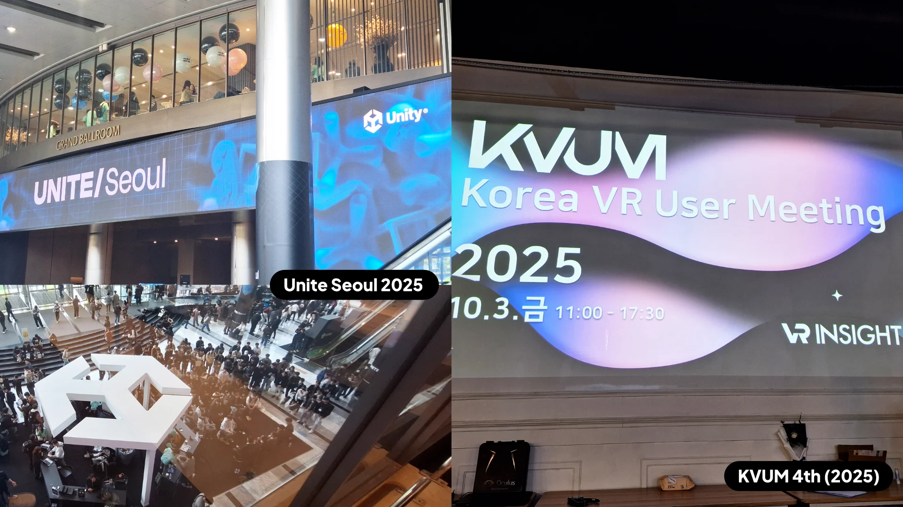
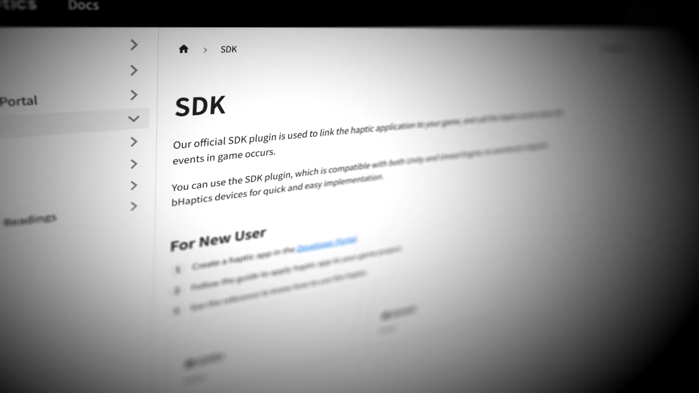
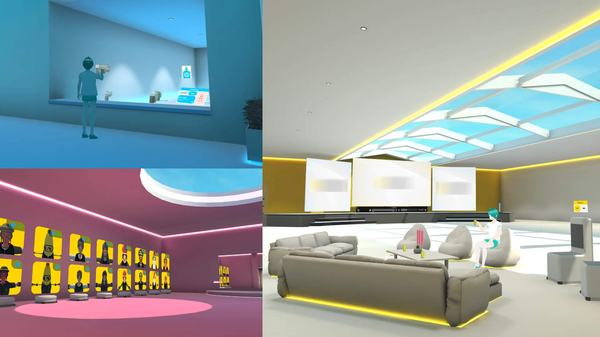
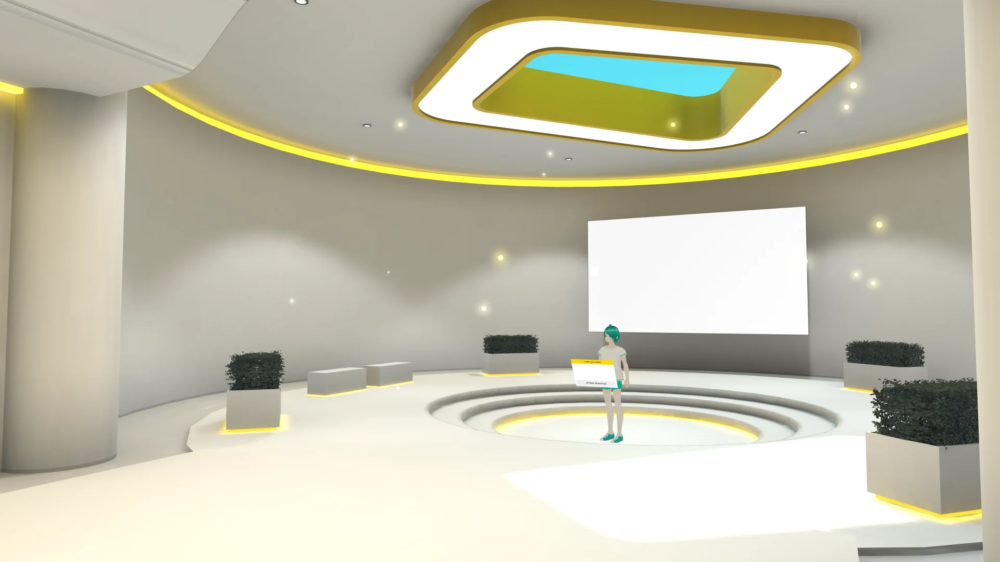
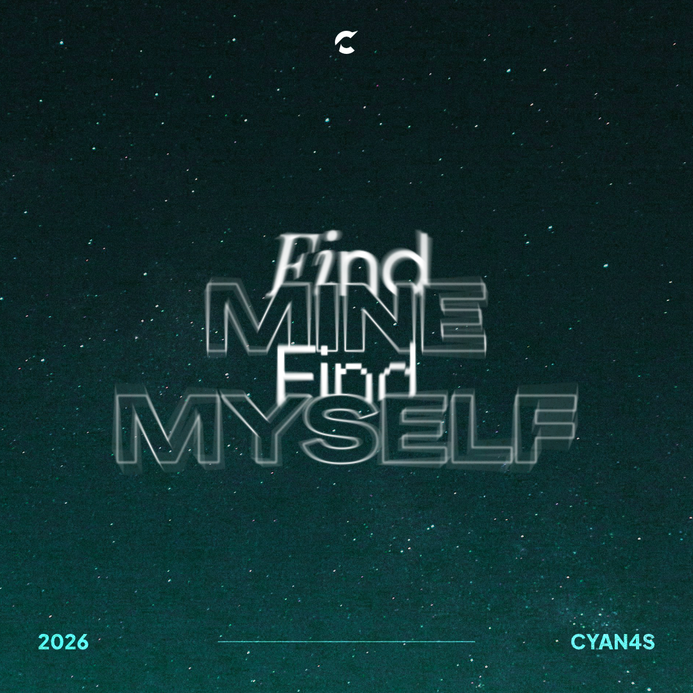

이 블로그에 간만에 글을 올려본다. 현재 다니고 있는 회사에 VR 개발자로 입사한 지 1년이 되었을 때, 기념 회고록을 위해 해당 글을 작성하기 시작했다. 그런데 바쁘다는 핑계로 글 완성을 미루다가, 4년 차가 되기 전에 부리나케 이 글을 완성하게 되었다.

## 취준

취준 시절의 2023년 중반기로 돌아가보자. 이야기는 [이전에 작성한 회고록](/blog/eof-2022-3)에서 이어진다. 대학 졸업 후 포트폴리오와 이력서를 정리하며 여러 곳의 문을 두드렸지만, 좋은 결과는 쉽게 나오지 않았다. 내가 졸업 이후 몇 달 동안에도 허덕이는 한편, 대학 동기들은 졸업 이전에, 혹은 졸업 직후 곧바로 일자리를 구했다. 나는 동기들을 축하하면서도, 마음 한 구석에선 "나는 왜 안 될까" 라는 절망감이 남았다.

첫 서류 탈락을 받아들이는 것은 매우 고통스러운 일이었다. 좌절감을 쉽게 떨쳐내지 못했지만, 이에 매몰되지 않으려 계속 다른 곳에 지원 서류를 넣었다. 설령 다시 탈락을 마주하게 되더라도, 다른 곳의 면접 준비를 위해 슬퍼할 겨를이 없는 환경 속에 나를 계속 밀어 넣었다.

총 14곳에 지원했고, 이 중 세 곳은 면접 탈락, 한 곳은 코딩 테스트 탈락, 나머지는 서류 탈락이거나 회신이 없었다. 사실 이 글을 작성하려고 오랜만에 구직 사이트에 접속해 그 당시의 지원 기록을 보았다. 수많은 탈락의 흔적을 다시 마주하는 일은… 여전히 고통스럽다.

여러 구직 사이트를 전전하던 중, 사람인에서 VR 컨텐츠 개발 공고를 발견했다. 해당 기업은 게이밍 및 미디어 소비에 특화된 햅틱 장비를 개발한 하드웨어 제조사이며, 햅틱 분야에서는 세계적인 입지를 가지고 있다. 특히 VR 게임에서 사용했을 때 몰입감을 한층 높여주며, VR의 초창기부터 일찍이 VR 시장에서 활약 중이다.

해당 기업 또한 서류 합격이 되어 면접을 보러 갔다. 이전 면접과는 분위기가 묘하게 다르게 진행되었고, 보다 밝은 분위기로 마무리되었다. 면접을 마치고 며칠 후, 생애 처음으로 "Job Offer"라는 전화를 받게 되었다. 정말이지 거의 울면서 전화를 마무리하고, 가족들과 기쁨을 공유했다.

사실 취준 시간이 길어지면서 마음이 조급해졌다. 취준 기간이 이보다 더 길어졌다면 웹 개발 쪽으로 전향하거나, 부트캠프 입소도 진지하게 고민했다. 그 전에 직장을 구하게 되어 다행인데, 돌이켜보면 정말 천운이었다고 생각한다.

그렇게 2023년 8월, 나의 첫 자취, 첫 서울살이, 그리고 첫 직장 생활이 시작됐다.

## 첫 VR, 첫 업무

일단 **VR개발자**로 들어오긴 했는데, 사실 VR 경험이 많지는 않다. 기껏해야 대학 시절 모바일 AR이나 Quest 2 프로젝트에 짧게 참여해본 것이 전부. 사실상 실무 경험이 전무했던 나에게 주어진 첫 목표는 이 낯선 VR 환경에 빠르게 온보딩하는 것이었다.

VR 게임에 익숙해지기 위해, 다양한 장르의 VR 게임을 체험해보았다. 그 중에는 시점이 과격하게 움직이는 게임도 있었는데, 이 때는 심한 3D 멀미로 고생하기도 했다. 이러한 경험은 역설적으로 '어떻게 해야 사용자가 멀미 없이 쾌적하게 VR을 즐길 수 있을까'를 고민하게 만들기도 했다.

이후 본격적인 첫 업무를 받았다. 업무를 진행하면서 사고 흐름을 최대한 상세히 기록했고, 진행 상황을 매일 보고했다. 작은 진행 상황이라도 최대한 투명하고 빈번하게 공유하는 습관을 들이려고 했다.

3개월 간의 수습이 끝나고, 수습 종료 선물로 Quest 3를 받았다. 이제 집에서도 언제든 VR 게임을 즐기고, 나만의 VR 환경을 만들 수 있는 든든한 장비가 생겼다.

## 출장

이 회사는 예전부터 전시회 참가에 적극적이며, 국내뿐만 아닌 해외 전시에도 자주 참여한다. 나는 국내에서 열리는 메타버스 전시회인 KMF 2024에 처음으로 출장을 나가게 되었다.

전시 출장 때 내가 주로 맡게 되는 업무는, 체험을 원하는 참여자의 VR 컨텐츠 데모 진행이다. VR 헤드셋 및 햅틱 장비 착용 및 해제를 보조하고, 참가자가 VR 컨텐츠를 원활히 체험할 수 있도록 진행을 위한 설명이 주가 된다.

### 해외로

이러한 운영 방식은 해외에서도 그대로 적용된다. 국내와 다른 점이라면 당연하게도, 모든 데모 진행을 비롯한 출장 기간동안의 생활을 모두 영어로 진행해야 한다는 점.

처음 **CES 2024**에 차출되었을 때 미국에 가야 한다는 사실이 겁이 났지만, 이런 기회가 흔치 않아 동시에 설레기도 했다. 평소에 외국에 나갈 생각 자체를 잘 안 해왔기 때문이다. 이전에 발급받은 여권이 만료가 된 것을 깨달아 재발급을 받았고, 미국에 방문할 때 ESTA라는 것을 승인받아야 한다는 점도 이때 알게 되었다.

언어 장벽은 솔직히 크게 걱정하진 않았다. 데모 진행에 필요한 영어는 어느 정도 고정되어 있고, 영어를 아예 못하는 편은 아니기 때문이다. 오히려 시차 적응과 체력이 가장 큰 난관이었다. 하루에 8시간 정도를 서서 데모를 진행하다 보니, 전시 후반이 되면 체력적인 한계를 절실히 느끼기도 했다.

데모 진행과는 별개로, 참가자에게 장비 정보나 기술 지원 등의 질문을 많이 받게 된다. 처음엔 영어로 답변하는데 많이 버벅였지만 시간이 지나자 어느 정도 말문이 트이게 되고, 결정적으로 질문들이 아무래도 정형화되다 보니 이후에는 비교적 수월하게 답변했다.

CES 2024 이후에도 해외 출장을 몇 번 더 다녀왔다. 지금까지 **GDC 2024, CES 2026, GDC 2026**을 위해 미국에 3번 더 방문하고, **Gamescom 2024**를 위해 독일에도 출장을 다녀왔다.

해외 출장을 가는데 지극히 개인적인 꿀팁을 공유하자면 다음과 같다:

- 장기간 비행 시 필수템은 수면을 위한 **안대**, 소음 차단을 위한 **노이즈캔슬링 이어폰**, 그리고 충전을 위한 **A to C USB 케이블**이다.
- 시차 적응에 **멜라토닌**이 매우 큰 도움을 주었다. 수면 1시간 전에 먹으면 잠이 잘 온다.

### 그 외에

데모 진행이 아닌 세미나 청취 목적으로 Unite Seoul 2025에 방문했고, 출장은 아니지만 VR 유저 모임인 KVUM 4th(2025)를 다녀왔다.

## 첫 리드, 기술 문서

**회사 공식 기술 문서 사이트**를 주도해서 제작했다. 2024년 3월에 시작하여 7월까지 집중적으로 진행했고, 이후로도 계속 조금씩 유지보수를 하고 있다. 나의 **첫 PM 업무**였으며, 내가 회사에 제시한 개선점이 실제로 반영되어 개발까지 이어진 경우였다. 

### UE와의 조우

회사에서 제공하는 SDK는 Unity뿐만 아닌, Unreal Engine(이하 UE), Python, JavaScript 등 여러 환경을 지원하고 있다. 한번은 회사 차원에서 UE 역량의 강화가 필요한 일이 생겼고, 따라서 회사 내에서 희망자를 모집하여 UE를 집중적으로 공부할 수 있는 시간이 주어졌다.

이전에 UE를 '그래픽 툴'로써 사용한 적은 있었지만, 게임 개발로써는 처음이다. 평소에 UE를 배워보고 싶었지만 명분이 없어 미뤄두고 있었는데, 모처럼 기회가 주어졌으니 이를 거절할 이유는 없었다.

이후 소수의 인원과 함께 한동안 UE를 집중적으로 공부하는 시간을 가졌다. 팀과 논의하여 괜찮아 보이는 온라인 코스를 선정했고, 한동안 강의를 집중적으로 들었다.

### UE를 배우면서

UE를 배우면서 처음 느낀 것은 확실히 Unity보다는 워크플로가 무겁다는 것이다. **블루프린트**라는 용어가 프리팹의 역할도 있고, 이벤트 그래프의 역할도 겸하고 있어 초반엔 이 점이 다소 혼동된다. 이와는 별개로, 블루프린트 이벤트 그래프는 생각보다 마음에 들었다.

개발 환경은 생각보다 신경 써야 할 것이 많았다. 스크립팅 전에 프로젝트를 한 번 빌드해야 하는 것, 헤더 파일에 정의하고 C++ 파일에 구현을 따로 적는 규칙 등 Unity와 비교하여 손이 가는 부분이 많았다.

주목할만한 점은, 스크립팅에 사용되는 C++는 일반적인 C++의 한계를 극복하기 위해 여러 장치들이 첨가된 C++이다. 매크로를 통해 리플렉션 등의 편의 기능을 구현하고, 기본 클래스인 UObject 객체의 생명 주기를 엔진에서 자동으로 관리해주는 등 Unity/C#의 개발 편의성을 C++에서 최대한 유사하게 제공하려는 노력이 보였다. 결과적으로 순수 C++보다는, C++ 문법을 채용한 UE 전용 언어를 다루는 인상이었다.

다만 어쨌든 C++은 C++이고, 어느 정도 C++에 익숙해있어야 원활한 코딩이 가능하다. 화살표 연산자(`->`)를 특히 많이 사용했고, null 체크 없이 포인터에 접근해서 에디터에 크래시가 발생하여 꺼지는 일도 종종 있었다. 따라서 최대한 null 포인터 접근을 일으키지 않게 조심해야 했다.

단순히 강의를 따라 게임을 만드는 것에 멈추지 않고, 원하는 기능을 추가해보기도 했다. UE를 다룸으로써, 실제 UE 게임 개발자들의 입장을 이해할 수 있게 되었다. 또한 Unity 사용자로써 UE와의 개발 경험 측면에서의 차이점을 알 수 있었다.

- **Unity**는 컴포넌트를 만들고 게임오브젝트에 결합하여 게임을 구현한다. 모듈형 구조를 통해 유연한 설계가 가능하며, 프로토타이핑에 유리하지만, 필요한 기능들을 모두 구현하고 관리해야 하는 책임이 있다.
- 반면 **UE**는 게임 프레임워크가 처음부터 구성되어 있다. 게임 진행에 필요한 요소마다 사전에 정의된 클래스들이 있으며, 이들 중 하나를 적절히 골라 상속받아 게임을 구현한다. 구조적 통일성을 유지하기 쉽지만, 초반 학습 부담이 있다.

추후에 이러한 차이점을 블로그에 더욱 디테일하게 다룰 시간이 있었으면 좋겠다.

### 기술 문서의 시작

UE 강의 수강 이후, 팀 세미나를 열어 팀 전체에 UE 개발 경험을 공유했다. 팀원 모두 Unity에 익숙하기에, Unity와 UE의 개발 경험 위주의 차이점을 정리해 발표했다.

UE 초심자도 SDK를 잘 활용할 수 있을까에 대한 결론을 세미나 막바지에 발표해야 했는데, 여기서 나는 SDK를 쓰려면 당연히 보게 되는 기술 문서의 퀄리티에 대해 분석하여 '**기술 문서의 개선**' 입장을 냈다.

사실 문서 개선의 의견은 입사 초기 온보딩 과정에도 낸 적이 있었다. 이제 문서 개선의 필요성이 회사 내부에서 점차 대두되기 시작했고, 또한 문서와는 별개로 회사에서 제작한 여러 저작 도구들에 대규모 업데이트가 예정되어 있어, 이에 대한 가이드 또한 필요한 상황이었다.

나는 이런 요구 사항들을 하나의 사이트에 모으는 기술 문서 제작을 지원하게 되었고, 그렇게 기술 문서 리뉴얼 프로젝트의 PM이 되었다.

### 작업

그동안 여러 분야를 찍먹하기 위해 여러 종류의 도구들을 이것저것 많이 다루다보니, 여러 종류의 기술 문서들을 많이 접해 봐서 기술 문서의 대략적인 구조를 알고 있었다.

하지만 감에 의존하지 않고, 다른 기술 문서들을 분석했다. 작업 초반에는 문서들이 어떻게 구조화되어 있는지를 중심으로 보고, 후반엔 문체 등의 사소한 디테일을 중심으로 보았다. 참고한 자료로 지금 생각나는 것만 적어도 Astro, Supabase, Meta Developer, Unity, Unreal, FMOD, Toss 등이 있다.

해당 기술 문서들을 분석하고, 우리 회사의 상황 및 요구 사항을 명확히 하여, 최대한 이상적인 구조를 만들어 발표했다. 어떻게 하면 전체적인 생태계를 사용자가 잘 이해할 수 있을까 고민을 많이 하게 되었다.

글 작성에만 그치지 않고, Figma를 통해 사진을 편집하고 필요하다면 다이어그램같은 시각적 자료도 만들었다. 웹 프레임워크는 내부적으로 선정된 Docusaurus를 사용한다.

### 협업

직접 PM 업무까지 맞으며 알게 된 사실은, 작은 작업조차 여러 부서의 이해관계가 얽혀 있다는 것이다. 이를 조율하기 위해 직접 회의를 주관하고 업무 협조를 구하며, 전체적인 타임라인을 조율하는 과정을 거쳐야 했다. 이는 3월부터 7월까지 집중적으로 이루어졌으며, 이 과정에서 엔지니어링 이상의 커뮤니케이션 역량을 기를 수 있었다.

한 평생 과묵한 내향인으로 살았던 내가, 남과 소통하는 역량이 크게 올라갈 수 있던 시간이었다.

한번은 팀장님과 잡담 중, 팀장님에게 **테크니컬 라이터**(Technical Writer)라는 개념을 처음으로 알게 되었다. 이런 문서를 전문적으로 작성하는 직책이 있다는 것이 놀라웠다.

### 릴리즈

예상치 못한 요소들이 많았지만, 끝내 공식 기술 문서 사이트를 공개했다. 이에 맞춰 회사 공식 홈페이지 및 플러그인 배포 페이지(AssetStore 및 Fab)에 있는 링크도 수정되었다. 이제 완전히 외부에 공개된 것이다.

사실 게임 컨텐츠 개발자치고 기술 문서에 너무 오랜 시간 투입되는 것 아닌가라는 생각이 들었다. 다만 회사 내에서 누군가는 해야 할 일이고, 이걸 담당하기 적합한 인물로 선정된 것이 나이기도 하다. 현재 회사 내에서 기술적 지식이 있으면서, 글을 쓸 수 있는 사람은 많지 않았다. 그럴수록 내가 만든, 그것도 내가 주도해서 만든 만큼 자부심이 드는 프로젝트였다.

회사 내외로 만족도가 생각보다 높은 것으로 보인다. 확실한 건, 회사로 기본적인 것을 물어보는 기술 문의가 눈에 띄게 줄었다는 것이다.

이후 피드백을 받아 마이너한 수정이 몇 번 이루어졌고, 이제 어느정도 안정화가 이루어졌다. 이후로도 크리티컬한 변경이 필요할 때 투입되며, 최근에도 작업이 잠깐 진행되었다.

## 다른 세계, VRChat

우리 회사의 제품으로 사용자들이 가장 많이 즐기는 컨텐츠 중 **VRChat**의 비중이 높다.

VRChat은 가상세계에서 사용자들끼리 교류할 수 있는 게임이자 일종의 메타버스이며, 사용자가 직접 컨텐츠를 만드는 UGC가 매우 크게 활성화되어 있다. 만들 수 있는 컨텐츠는 크게 두 가지로, 아바타, 그리고 월드이다. **아바타**는 플레이어가 조종하는 플레이어를 상징하는 캐릭터이며, **월드**는 그 아바타들이 방문하여 상호작용할 수 있는 공간이다.

특히 자신을 대표하는 자신만의 아바타를 Unity에서 직접 제작하여 VRChat에 업로드하여 사용할 수 있다. 그런 만큼 아바타 제작에 도움을 주는 도구 또한 수없이 많다.

### 인연

우리 회사에서도, 자신이 만든 아바타에 우리 회사의 장비와 관련된 기능을 적용할 수 있는 아바타 패키지를 제공하고 있다.

그런데 VRChat이 점차 지원하는 하드웨어 플랫폼을 늘려가면서, 우리 패키지 또한 이에 대응할 수 있도록 패치가 필요했다. 내가 해당 아바타 패키지 업데이트 개발에 참여하게 되었는데, 이로 인해 VRChat과의 인연이 시작되었다.

### 월드 제작

2024년 10월, VRChat에 익숙한 기획자와 함께 개발에 착수했다.

근데 문제는 내가 VRChat 월드 개발을 주도하겠다고 나선 것 치고 VRChat에 대해 너무 몰랐고, 기획자는 VRChat 생태계를 잘 알고 있었다. 따라서 기획 회의가 열릴 때마다 기획자의 말을 최대한 따르기 시작했다. 이로 인해 초기엔 공동 기획이었는데, 뒤로 갈수록 기획자가 기획을 보내면 내가 구현 가능 여부를 다시 보내는 방식으로 분업이 이루어졌다.

물론 나도 백지 상태에서 개발을 이어가고 싶지 않았으며, VRChat 커뮤니티를 최대한 배우려고 했다. 월드를 개발하면서 틈틈이, 심지어 퇴근하고 나서 집에서도 여러 유명 월드를 디깅하면서 특징들을 캐치했고, 포럼 등에 올라온 유용한 글을 많이 찾아봤다.

다만, 구현에 필요한 시간이 예상보다 길어지게 되어 기획에 힘을 못 쏟게 되었다.

### 난관

프로그래밍에서 예상치 못한 난관을 여러 번 맞이했다. 스크립팅 언어인 U#(UdonSharp; VRChat에서 제작한 C# 서브셋)의 스펙 제약, 월드 용량 제약, 셰이더 제약 등의 여러 제약들이 개발 과정 내에 종종 발목을 잡았다.

그런데 기술적으로 더 큰 장벽이 있었으니, 바로 **멀티플레이어 로직**이었다. 평소엔 싱글플레이어 게임만 만들다 보니, 멀티플레이어 게임을 만들 때는 동기화 문제가 항상 말썽이었다. 분명 로컬 환경에선 멀쩡히 나가는 총알이 상대방 화면에선 보이지 않는 등, 무기를 하나 만들 때마다 '**상태 동기화 이슈**'라는 벽에 부딪혔다.

그래서 VRChat 공식 문서뿐만 아닌, 다른 월드의 구현 방식, 심지어는 일반 멀티플레이어 이론까지 살펴보며 공부했고, 버그 픽스와 테스트를 무한으로 반복했다. 불행 중 다행으로, VRChat SDK에 멀티플레이어 환경을 쉽게 테스트 해볼 수 있게 개발 환경이 구축되어 있었다.

예전에 아주 잠깐 멀티플레이어 게임 개발을 공부했을 때 들은 말인 "**멀티플레이어 기능이 필요하게 될 수 있다면, 개발 처음부터 멀티플레이어를 염두에 두고 빌드해야 한다.**" 가 어떤 의미였는지를 뼈저리게 느끼게 된 순간이였다.

### 아쉬움

제작 과정에서의 나를 한 번 돌아보자면, 아쉬움이 매우 크다. 마감을 못 지켜서 규모 축소와 출시 연기를 계속 요청했다. 이게 중요도가 상대적으로 낮아 다들 크게 뭐라 안 한 것이였지, 만약 중요도가 높았다면 매우 큰 문제가 되었을 것이다. 앞으로 일정 산정 시에는 기술적 난이도뿐만 아니라 예상치 못한 변수까지 고려하는 신중함을 기해야겠다고 다짐했다. 하지만 지금도 여전히 일정 산출에 대해 감을 확실히 잡지는 못한 상황이다…

다만 멀티플레이어 게임 구현에는 자신감이 붙었다. 이렇게 한번 데여보니, 나중에 멀티플레이어 게임을 만들 때 적어도 두려움 없이 도전할 수 있을 것 같다. 프로그래밍 역량 하나 만큼은 크게 기른 것 같다.

일본 전시회를 위해 잠시 프라이빗 공개가 되었고, 이후 수많은 QA 및 버그 픽스를 거쳐 공식 릴리즈 날짜를 잡았다.

### 공개

우여곡절 끝에 2025년 2월, 우리 회사의 공식 VRChat World가 세상에 나오게 되었다. 솔직히 지금 결과물을 돌아보면, 투입된 시간과 자원에 비해 최종 규모가 너무 작게 느껴진다.

전체적인 비주얼 컨셉은 **미니멀 인테리어 및 간접광 조명**이다. 색상은 흰색과 노란색을 중심으로 하되, 각 Area를 위해 하늘색과 분홍색을 사용하여 **색의 삼원색**을 통한 시각적 구분을 의도했다.

지금 보면 로비 비주얼이 특히 예쁘게 나왔다. Blender를 사용해 모델링까지 하면서 나온 결과물이다. 지금 생각해보면 로비에 너무 힘을 준 나머지, 다른 곳은 뭔가 비주얼적으로 심심하게 보인다. 실제로 나머지 구역은 그냥 큐브들을 조합해서 만들었다…

해당 월드를 회사 차원에서 엄청 홍보를 하지는 않았지만, 박람회에서의 시연에서 종종 사용되었다. VRChat 유저들에게 단순히 '장비가 VRChat과 호환된다'라고만 말하는 것보다, 전용 월드까지 함께 체험하게 하는 것이 더 어필이 되는 것 같다.

이외에도, 몇몇 유튜버들이 해당 월드에서 촬영한 영상이 종종 등장하기도 했다. 이를 보면 묘하면서도 뿌듯하다. 내 손을 거친 작업물을 남들에게 보여준다는 것은 언제여도 항상 뿌듯한 일이다.

## 요즘

이후 기술 문서 갱신 및 VRChat 컨텐츠에 대해 마이너 업데이트를 몇 번 진행했다. VRChat을 깊게 팠기에, 아무래도 VRChat 관련 기술적 문의는 주로 내가 전담하게 되었다.

그 외의 일들은 결과물이 내부적으로만 사용되거나, 아직 세상에 공개되지 않아 상세히 설명을 할 수는 없다. 그냥 그 이후론 계속 컨텐츠 개발을 하고 있다.

### 회사 일 외에

2024년 12월 4일, 대한민국을 크게 흔든 전대미문의 사건이 있었다. 사회적인 혼란으로 인해 나 또한 심리적으로 흔들렸고, 이로 인해 새로운 작업물을 내고 싶은 생각이 없었다. 함께 이 시기를 이겨낸 여러분들에게 고생했고 감사하다는 말을 전하고 싶다.

2025년에 **HYPERVOX**라는 리듬게임의 개발에 잠시 참여했다. 주말을 활용하여 개발에 참여했는데, 문제는 개발 기간이 길어지다보니 중간에 번아웃이 오기도 했다. 확실히 회사를 다니면서 규모가 있는 사이드 프로젝트를 하는 것은 아직은 무리인 것 같다. 현재 [Steam에 출시](https://store.steampowered.com/app/4316710)한 상태다.

블로그에 글을 많이 써서 활성화시키고 싶은데, 어떻게 매번 글의 규모가 쓸 때마다 커지는지 모르겠다. 이 글은 첫 작성 시작으로부터 3년을 코 앞에 두고 완성했다. 글 하나를 길게 쓰는 것보다, 짧게라도 글을 자주 쓰는 습관을 들여야겠다.

### 그리고 AI에 대해

최근 업계의 화두는 단연 **AI**다. 나 또한 한 명의 개발자이자 창작자로서 상당히 복잡한 마음으로 이 변화를 지켜보고 있다. 사실 지금 이 게시글도 AI에게 '베타 리더'를 요청하여 검토를 받았다.

일단 나와 내 주변의 입장을 대략 정리하면, '코드 생성은 환영이나 품질은 좀 더 지켜봐야 하며, 예술 영역은 윤리로나 품질로나 부정적'이다.

주로 사용 중인 AI는 Claude다. Claude Code에 Unity MCP를 연결하여 사용 중이며, Unity 게임 프로그래밍 파트에서 활용하고 있다. 구현 아이디어를 입력하면 AI가 상황에 맞게 구현하는 방식으로 주로 사용 중인데, 현재 상황과 요구 사항을 명확히 입력하면 꽤나 좋은 코드가 나온다. 다만 아직까진 기능을 처음부터 완전히 구현하라고 했을 땐 결과물이 아쉬우며, 결과물이 좋아도 중간에 개입을 몇 번 하긴 해야 한다.

Claude 이전엔 JetBrains사의 Junie를 많이 사용했으며, 지금도 가끔 사용한다. Gemini는 프로젝트에 종속적이지 않은, 보다 일반적인 상황에서 자주 사용한 적이 있다. 프로그래밍 이론이나 프레임워크 사용법과 같은 프로그래밍 관련 질문 이외에도, 글 번역이나 사진 검색, 관광지 추천같은 일상적인 상황에도 종종 활용했다.

이와는 별개로 예술 분야에 AI를 활용하는 것에 대해서는 부정적인 편이다. 예술가의 작품을 AI 학습을 위해 무단으로 사용하고, 심지어 AI의 결과물을 가지고 와서 기존의 예술가를 폄하하는 일을 자주 볼 수 있다. 기술의 발전만큼 윤리 의식의 부재가 눈에 띄는 모습이다. 분명 AI가 예술가를 돕는 유용한 도구로 발전할 수도 있었을텐데, 지금 상황을 고려했을 땐 아쉬움이 크다.

또한 나름 예술가의 측면에서 바라봤을 때, AI가 만든 결과물에서 먼저 느껴지는 감정은 바로 반감이다. 작가의 정성이나 의도가 드러나지 않으며, 이로 인해 위화감을 불러 일으킨다. 또한 겉으로 보이는 품질은 화려하고 좋아보이지만, 완급 조절 없는 이 화려함이 오히려 피로감을 불러 일으킨다. AI의 발전이 작품 생태계의 다양성이 소멸되는 것이 아닌가 우려가 크다.

일단 회고록이니만큼 AI에 대한 얘기는 여기서 마치겠다. 아직은 AI에 대해 머리 속이 복잡하다.

### 한 번 돌아보자

2024년의 경우 여러 난관도 많이 겪은 만큼, 얻은 것도 많았다. 이에 비해 2025년은 정지한 해와 같았다. 현재 이 글도 대부분 2024년의 내용들이고, 2025년에 뚜렷한 성과가 있었냐 하면 선뜻 답하기가 어렵다.

## ./2026

이제 2026년이다. 최근엔 나의 정체성이 점점 희미해지는 것을 느낀다. 무색무취한 삶에서 벗어나기 위해, 이제 적극적으로 변화를 탐구해야 할 시기가 다가왔다.

올해는 내가 진정 원하는 게 무엇인지, 내 자신에게 좀 더 귀 기울여보는 시간을 가질까 한다. "Find mine. Find myself." 는 이를 내 마음 속에 각인하기 위한 올해 나의 슬로건이다.

올해 목표는 크게 두 가지이다: **게임 기획 배우기, 그리고 음원 발매**.

### 게임 기획 실력 늘리기

지금까지의 나에게 게임 개발이라면 주로 프로그래밍을 의미했고, 부수적으로 비주얼을 담당할 수도 있었다. 이제 기획에 있어서도 가시적인 성과를 보여주고 싶다.

지금껏 기획은 업계 선배로부터의 조언이나 개인적인 직감에만 의존했다면, 이제는 책이나 여러 강좌를 통해 더욱 체계적인 이론을 정립하여, 유저들에게 더 깊은 몰입감을 줄 수 있는 게임을 기획해보고자 한다.

또한 배우는 것에만 멈추지 않고, 올해는 작더라도 나만의 색이 담긴 게임을 실제로 Steam과 같은 정식 게임 플랫폼에 올리는 것이 목표이다.

### 음원 발매

정말 뜬금없긴 하지만, 올해 안에 곡을 하나라도 발매하고 싶다. EDM에 빠져 작곡을 처음 시작한 것도 이제 7년 정도 된 것 같다. 그동안 FL Studio 다루는 방법이나 작곡 이론을 YouTube에서 잠깐 찾아 공부한 것이 전부이고, 뚜렷한 작업물은 없다. 사실 [SoundCloud](https://soundcloud.com/cyan4s)에 트랙 몇 곡 올린 걸로 스스로를 음악하는 사람이라 부르기 민망하다. 그래서 올해는 꿈을 크게 가져보려 한다.

올해 안에 적어도 한 곡을 발매한다. SoundCloud에만 올리는 것이 아닌, 정식 유통사를 거쳐서 Apple Music이나 Spotify 같은 스트리밍 플랫폼에 올라가는 것이 목표이다.

### 끝으로…

이 회고록이 누군가에게는 공감이, 누군가에게는 작은 응원이 되길 바랍니다. 글이 쓰다 보니 굉장히 길어졌는데, 끝까지 봐주셔서 감사합니다. 늦었지만 행복한 한 해 되세요.
