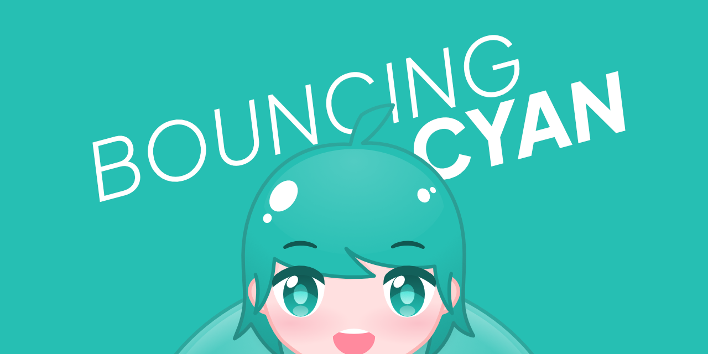

🎈 저의 페르소나 캐릭터 '시안'의 애니메이션 시연 웹사이트입니다.

- **시연 링크** — [https://boun.cyan4s.com/](https://boun.cyan4s.com/)

**Affinity Designer**

캐릭터를 디자인하였습니다. SVG 형식의 벡터 이미지인 것이 특징입니다.

**SVGator**

캐릭터가 통통 튀는 에니메이션을 제작하였습니다.

**SolidJS, TypeScript**

설정 창을 통해 모션의 종류, 배경 화면, 레이블 표기 여부를 사용자가 직접 선택할 수 있습니다.

**Vite, Cloudflare Pages**

프로젝트 빌드에 Vite을 사용하며, main 브랜치에 push하면 자동으로 빌드 및 배포가 이루어지게 환경을 구성하였습니다.
